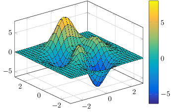

# surf3tikz

surf3tikz is a MATLAB function that creates a TikZ+PNG file from a 3D plot.


## Overview

To achieve its goal, surf3tikz determines the corner points of the surrounding axes box and
determines their pixel paper position later in the PNG file by placing markers on the points and
then detecting the position in a temporary MATLAB image. surf3tikz tries to choose points that are
in accordance with the needs of PGFPlots inner workings (see **Background Information** chapter).

Additionally the key values are available as output parameters, so you can build your own TikZ file
from scratch.


## Usage

### Notes of importance

* This function was only tested with _Ubuntu Linux_ and _PGFPlots_ 2016/01/06 v1.13
* To get rid of the white background of the PNG, the script makes a system call to _mogrify_, which is part
  of the _ImageMagick_ suite (ImageMagick 6.8.9-9 was used). If you cannot provide this program, you
  might want to do this step (white -> transparent) later on with an external program.

### Using the function

surf3tikz takes in between two and four input parameters:

1. the handle of the figure to be converted to TikZ
2. an extension-less name for the output files (can include a path)
3. a config structure
4. a debug switch to plot additional debug information

If you want to build your own TikZ file, you can suppress the writing of both PNG and TikZ file
separately via the config structure and instead use the data provided by the output parameters:

1. TikZ support point positions on paper, in the pt unit
2. corresponding (X,Y,Z) data 
3. colorbar meta limits

For further information on the particulars of the in- and output parameters see the documentation
within the file.

The simplest way to use the function is to open your figure and choose a desired view. Then call the
function with `gcf` for the first and an arbitrary name for the second parameter

### Correct choice of screen ppi

One of the most important parameters is the screen ppi setting. The function tries to automatically
determine the correct setting, but I have found that MATLAB versions older than _2016a_ tend to get
the wrong value from the corresponding `get` call.

Before you give up or file a bug report, you may want to test some different values first. Likely
values seem to be (I'll update the list with more information as soon as I get it):

* 96 ppi
* 72 ppi

There is a bit of information available about this topic in the MATLAB help page about
[DPI-Aware Behavior in MATLAB](http://de.mathworks.com/help/matlab/creating_guis/dpi-aware-behavior-in-matlab.html).


## Background Information

Here, some of the underlying theory that was used to make this function is explained. This might
help others to either understand (or point out errors in) certain parts of the program.

### The reason for using axes box corner points

In an earlier draft, this function used visible min and max points in both viewing directions to
determine good support points. This worked reasonably well for many cases but had some major
drawbacks. For once, potentially every plot has to be examined to get good points that don't lie
too near to each other. More importantly however, in cases where one point marks two extrema
(e.g. one point is that much left and up that it is both the most left **and** most up point),
leaving only 3 or even 2 points.

This function using the corners of the axes box as support points provides the following advantages:

* Because of the very deterministic nature of the box (which is always, well, box-shaped) there are
   always enough points to choose from.
* The box normally surrounds the whole plot, making it unnecessary to examine all plots within the
   axes.
* Also, the fact that the box surrounds the plot means that we always get a good distance coverage
  in all three data domain dimensions.
* The simple geometry (and deterministic nature) of the box makes it easy to choose the right
   points automatically (for the most part...)

### On the topic of choosing correct support points

PGFPlots has very specific needs when it comes to support points to determine the orientation of its
axes. The following assumptions have been made with much black box testing and data examination:

* More than four points do nothing to help recover from an already bad choice of points. Moreso,
  there seems to be no influence from all points beyond the first four.
* The pt-positions of the first two points should differ in both directions to get a more consistent,
  instead of just the Y coordinate, as PGFPlots suggests in its error message.
* Within this set of points, for each data domain dimension (X,Y,Z), there has to be at least one set
  of two points that differ in every dimension but the one it's associated with.

To extend on the last point and further explain the selection process of the support points, let's
consider a small example of a surf plot (which by the way was created by this function):



The surrounding box has the following X, Y, and Z limits:

```
X: [-4,4]
Y: [-4,4]
Z: [-10,10]
```

With this, the following 8 corner points are available:

```
P1=(-4,-4,-10)
P2=(-4,-4,10)
P3=(-4,4,-10)
P4=(-4,4,10)
P5=(4,-4,-10)
P6=(4,-4,10)
P7=(4,4,-10)
P8=(4,4,10)
```

Valid point sets for the data domain dimension _X_ are those where the Y and Z values both change but
stay the same for _X_. An example would be _P1_ and _P4_. Analogue for the other two dimensions.

If we do this for all the dimensions, we get the following possible point sets:

```
for X:
{{1,4},{2,3},{5,8},{6,7}}

for Y:
{{1,6},{2,5},{3,8},{4,7}}

for Z
{{1,7},{2,8},{3,5},{4,6}}
```

When we examine these sets (which are the same for each plot, because they solely depend on the
order in which the corner points are formed), it becomes apparent that there are two ways of
determining four points that fulfill the aforementioned constraints:

* We can either use four points that together fulfill the constraints for all dimension. There are
  only two point sets in that sense: _{1,4,6,7}_ and _{2,3,5,8}_. This is the way the points are
  chosen in this function right now.
* The other way would be to let 3 points fulfill the constraints and then add another arbitrary
  points, for example _{1,4,7,2}_. Of course there are much more possible solutions. Right now it's
  unknown what happens if one chooses points this way. Therefore, for now this solution is not used
  in this function.

### The issue with bird's eye views

As of now this function does not has any special functionality to deal with bird's eye viewed plots,
i.e. plots with 90° elevation. This is due to the importance that the z axis is exactly
perpendicular to the viewing plane. Sometimes bird's eye view plots seems to work just fine,
sometimes PGFPlots will throw a fit. Here are some notes on what I found out via testing:

* Plots with El=90° and Az~=0° seem to be the main part of the problem.
* PGFPlots sometimes has problems with fractional pt values. This function by default employs a
  rounding functionality to round to the next full pt value. You might want to check the output of
  the TikZ file an manually correct the values a bit, if two values that should have been the same
  are one pt apart
* If it does not work the first time, I had some luck manually resizing the figure and trying again.
  Some aspect ratios seem to work just fine, others don't.


## General Notes

* For now, if you try to run this script on a surf with a view of El=90°, PGFPlots will sometimes
  throw a dimension error.
* There is a point to be made to use imagesc instead of print in some situations. However, for now
  it's not implemented in this function yet.
* The name surf3tikz seems strange, but was used to prevent naming conflicts with a similar script
  named surf2TikZ by Fabian Roos which this script is loosely based upon.
